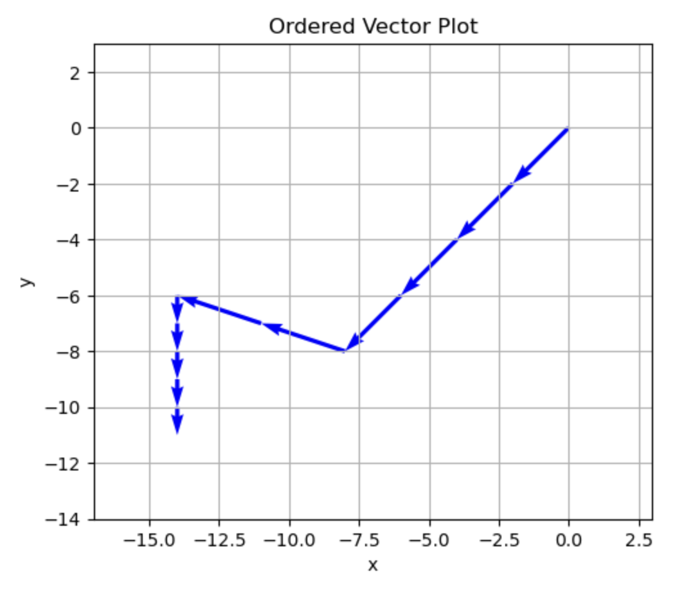
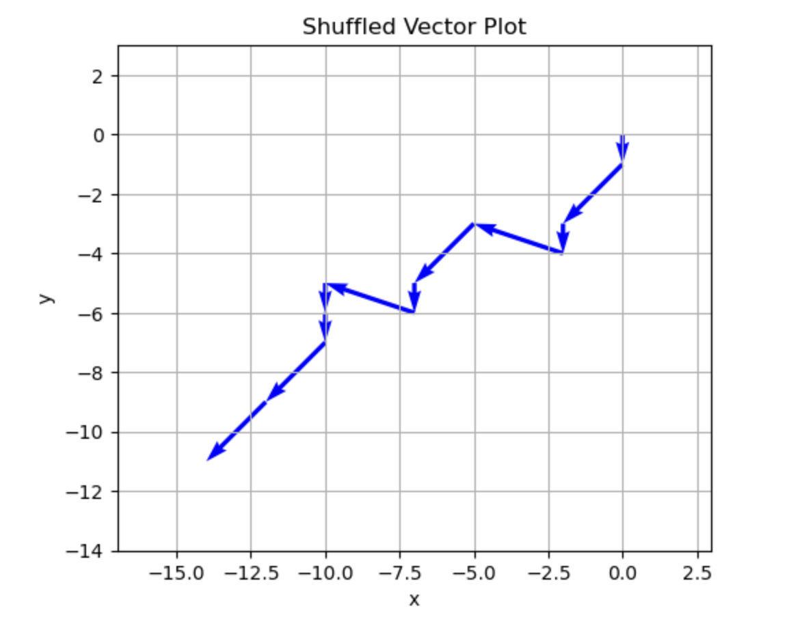

# Vector Math Visualizer (Mathematics for Machine Learning Exercises)

## Table of Contents

* [Project Overview](#project-overview)
* [Vector Math Visualization](#vector-math-visualization)
    * [Vector Math – Key Concepts](#vector-math--key-concepts)
    * [Vector Math – Why This Is Useful](#vector-math--why-this-is-useful)
* [Dot Product Trial](#dot-product-trial)
  * [Dot Product – Key Concepts](#dot-product--key-concepts)
  * [Dot Product – Why This Is Useful](#dot-product--why-this-is-useful)
* [Repository Structure](#repository-structure)
* [Credits](#credits)

---

## Project Overview

This repository tracks my hands-on exercises and notes from the Coursera course **Mathematics for Machine Learning: Linear Algebra** by **Imperial College London**. Rather than strictly following a week-by-week format, I’m creating individual tools and notebooks that help me better understand key topics through code and visualization.

Each notebook is meant to serve as a standalone explanation of a concept I find important, and something I can easily refer back to.

---

## Vector Math Visualization

This notebook explores **vector addition**, **subtraction**, and **scalar multiplication** using a plotting approach in Python with `matplotlib`. It includes an interactive section where vectors are appended to a list and visualized using a custom function.

In addition to scalar multiplication and directional plotting, the notebook demonstrates the **commutative property** of vector addition by shuffling the order of vectors and showing that the final position remains unchanged.

The plot shows how vectors:

* Chain tip-to-tail
* Change length with scaling
* Reverse direction with subtraction or negative scalars
* Accumulate position

**Original Order Plot:**



**Shuffled Order Plot (Commutativity Check):**



Notebook location:

```bash
Subjects/vector_math/vector_math.ipynb
```

Key additions in this version:

* A function to build and visualize vectors step-by-step
* Scalar multiplication applied through repetition
* Comparison of ordered vs. shuffled vectors to confirm commutativity

---

## Vector Math – Key Concepts

* Vectors as directed quantities
* Tip-to-tail addition and subtraction
* Scalar multiplication and scaling effects
* Coordinate representations using basis vectors (i, j)
* Commutativity and associativity in vector addition

---

## Vector Math – Why This Is Useful

This notebook is built on the early vector lessons of the course, where we first explored what makes a vector and how we can manipulate them algebraically and geometrically. It helped clarify how:

* Vectors describe direction and magnitude
* Scalar multiplication changes size without changing direction
* Subtraction flips the vector
* Vector addition creates chained movement from point to point

In the course, vectors are introduced not just as arrows in space, but also as lists of attributes — which becomes important later in machine learning. This notebook makes those early lessons easier to see in action and gives me something to review or extend as I move deeper into the math.

Vectors also play a foundational role in machine learning. They’re used to represent input features, model weights, and encoded objects like words or images. Understanding how vectors behave when added, subtracted, or scaled makes it easier to understand how models transform data, how optimization works through gradients, and how data moves through high-dimensional spaces.

---

## Dot Product Trial

This notebook demonstrates how the **dot product** relates to vector size, angle, and directional similarity, and includes scalar and vector projections.

### Features

* Generates two random n-dimensional vectors (or allows custom input)
* Calculates the dot product and magnitudes
* Uses the cosine formula:
  **a · b = |a| × |b| × cos(θ)**
* Interprets whether vectors point in the **same**, **opposite**, or **orthogonal** directions
* Calculates:

  * Scalar projection of one vector onto another
  * Vector projection of one vector onto another
* Reinforces geometric understanding through printed explanations

### Sample Output

```
Vector 1 looks like:
[4, 3]
and has a magnitude of 5.0

Vector 2 looks like:
[1, 2]
and has a magnitude of 2.2361

DOT PRODUCT RESULT:
The Dot product of vectors 1 and 2 is 10, which means that the vectors point in a similar direction

COSINE FORMULA BREAKDOWN
Comparing to the cosine formula:
vector1 · vector2 = |v1| * |v2| * cos(θ)
10 = 5.0 * 2.2361 * 0.8944
10 = 10.0

GEOMETRIC INTERPRETATION OF COS(θ)
To put Simply, this tells us:
• If θ = 0°, then cos(θ) = 1 → vectors point in the same direction.
• If θ = 90°, then cos(θ) = 0 → vectors are perpendicular (dot product = 0).
• If θ = 180°, then cos(θ) = -1 → vectors point in opposite directions.
→ The dot product combines the size of both vectors and the cosine of the angle between them.

SCALAR PROJECTION OF VECTOR 1 ONTO VECTOR 2
The Scalar Projection of Vector 1 onto Vector 2 is 4.4721
→ This is the length of the 'shadow' cast by Vector 1 onto Vector 2.

SCALAR PROJECTION OF VECTOR 2 ONTO VECTOR 1
The Scalar Projection of Vector 2 onto Vector 1 is 2.0
→ This is the length of the 'shadow' cast by Vector 2 onto Vector 1.

VECTOR PROJECTION OF VECTOR 1 ONTO VECTOR 2
The Vector Projection of Vector 1 onto Vector 2 is [2.0, 4.0]
→ This is the vector that shows how much of Vector 1 lies *along* Vector 2.

VECTOR PROJECTION OF VECTOR 2 ONTO VECTOR 1
The Vector Projection of Vector 2 onto Vector 1 is [1.6, 1.2]
→ This is the vector that shows how much of Vector 2 lies *along* Vector 1.
```

### Notebook Location

```
Subjects/vector_math/dot_product_trial.ipynb
```

---

## Dot Product – Key Concepts

* The dot product measures how aligned two vectors are
* Cosine rule: **a · b = |a||b|cos(θ)**
* Scalar projection = how far one vector stretches onto another
* Vector projection = a scaled version of the second vector in the direction of the first
* Interpretation:

  * Positive → same direction
  * Zero → perpendicular
  * Negative → opposite direction

---

## Dot Product – Why This Is Useful

Understanding dot products is essential for both geometry and machine learning:

* It tells us **how much two vectors "agree" in direction**
* Cosine similarity (based on dot product) is used in:

  * Text similarity (natural language processing)
  * Recommender systems
  * Image comparison and embedding alignment
* Helps with:

  * Projection of one vector onto another
  * Understanding gradients, angles, and alignment in high-dimensional spaces
  * Reducing dimensions or extracting directional components from vectors

---

## Repository Structure

```
Subjects/
└── vector_math/
    ├── vector_math.ipynb            # Vector operations visualization
    └── dot_product_trial.ipynb      # Dot product + projection calculator and explanation
assets/
├── vector_plot_example.png          # Ordered vector plot
└── vector_plot_commutative.png      # Shuffled vector plot (commutativity)
README.md                            # This file
```

---

## Credits

* Course: [Mathematics for Machine Learning](https://www.coursera.org/learn/linear-algebra-machine-learning) by Imperial College London
* Visual explanations based on my interpretation of course material
* Plots generated using `matplotlib`

---

**Made by Sean Schallberger**
Exploring math and machine learning through code, one concept at a time.
